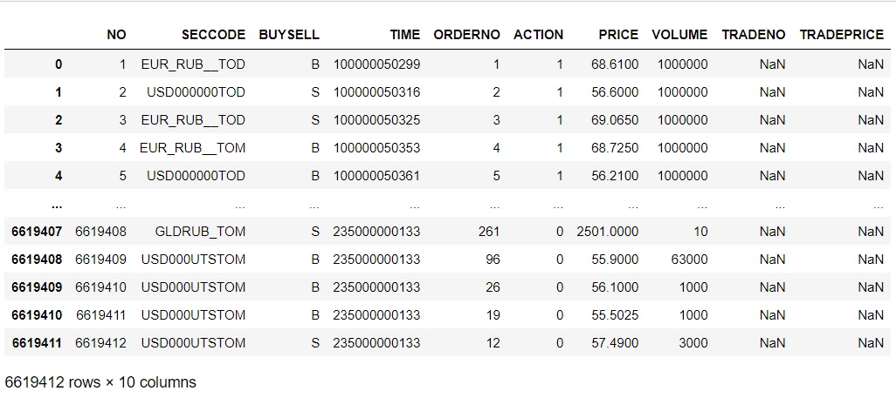
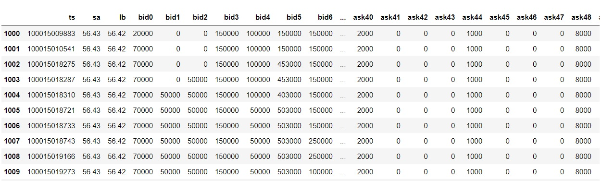
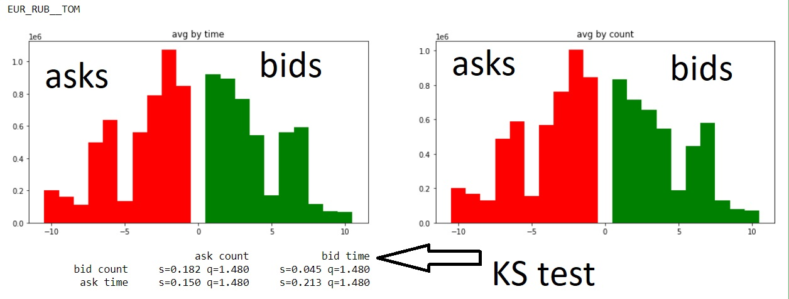

# General Description 
This is a study project on `Data mining` course on processing  [Moscow exchange dataset](https://disk.yandex.ru/d/pYd6diTKHfj8ow?w=1) with `python`  
The dataset include order log of bids and asks on Moscow exchange for 3 month, 21-22 working days per month, ~5.000.000 - 8.000.000 transactions per day, `~405.000.000 data rows total`

My work include:
- Generating **order log** for each moment
- Correlation analysis
- **Feature extraction** and analysis
- Lead-lag analysis 
- Fractional order differentiation with unit root test to preserve information while making process stationary
- Making machine learning task

# Dataset
Dataset is log of transactions occurred on Moscow exchange for 6 instruments
- USD000000TOD
- USD000UTSTOM
- EUR_RUB__TOD
- EUR_RUB__TOM
- EURUSD000TOD
- EURUSD000TOM
## Day 1 of the first month

-----------
| Field name | Type | Description | .
| ----|---- | --- | ---
| NO | Int | Record number |
| SECCODE | String | Instrument code |
| BUYSELL | Char | Buy / Sell |
| TIME | LongInt | Timestamp in HHMMSSZZZXXX format |
| ORDERNO | Int | Order number |
| ACTION | Byte | Order type: 0=Revoke, 1=Post, 2=Match |
| PRICE | Float | Price of the order |
| VOLUME | Int | The volume of the order |
| TRADENO | Int | Trade number |  for Action = 2
| TRADEPRICE | Float | Price of the deal | for Action = 2

# Order book 
## Generation

While generating order book I record several static features into a new dataframe:

| Field name | Type | Description | .
| ----|---- | --- | ---
| ts | Int | unix timestamp |
| sa | Float | smallest ask |
| lb | Float | largest bid |
| bas | Float | bid-ask spread |
| bid0-bid49-ask0-ask99 | Floats | *orderbook spectrum* at this point in time | 
  
*Orderbook spectrum* is distribution of bids and asks with step equal minimal price increment for this instrument  

## Analysis
If we want **average** orderbook spectrum **for a day** we can take average by time or by count

Then we can use the `Kolmogorov–Smirnov test (KS test)` between bids and asks to check if there's is a bias and predict price direction

I also used KS test to compare distributions between different days and different time periods e.g. 10:00 - 15:00, 15:00 - 19:00, 19:00 - 23:50

# Feature extraction
To be able to train a machine learning algorithms we need first to found good features and normalize them

| Field name | Type | Description | .
| ----|---- | --- | ---
| ts | Int | unix timestamp |
| bas | Float | bid-ask spread |
| bid0-bid9-ask0-ask9 | Floats | grouped *orderbook spectrum* at this point in time | now 10 groups instead of 50 like before
| VWAP_(ask/bid)_(100k/200k/500k/5m/10m) | Floats | [volume weighted average price](https://en.wikipedia.org/wiki/Volume-weighted_average_price)
| agro_(ask/bid)_(1s/5s/15s/30s/60s) | Floats | number of agressive asks/bids for the last 1s/5s/15s/30s/60s from current timestamp | `liquidity trading`
| passive_(ask/bid)_(1s/5s/15s/30s/60s) | Floats | number of passive asks/bids for the last 1s/5s/15s/30s/60s from current timestamp | `liquidity replenishment`

53 features total

- orderbook spectrum merged into buckets to avoid too much dimensions
- orderbook spectrum normalized by maximum band during a day
- VWAP normalized by minimal price increment
- bid-ask spread normalized by minimal price increment
- liquidity trading and replenishment normalized by time and maximum band during a day

# Task for machine learning
Price predictions using these features can be described in several ways
1. Regression: Predict price at t + dt
2. Classification: Price in t+dt will be >=p+dp or <=p+dp or wont change
2. Classification2: Price in on interval [t,t+dt] will hit >=p+dp or <=p+dp or wont 

We can found all of these numbers if we will present price at each point in time as a sum of `trend` and `Brownian motion`. Then we will only need to predict 2 coefficients: of trend and Brownian motion changing in time

